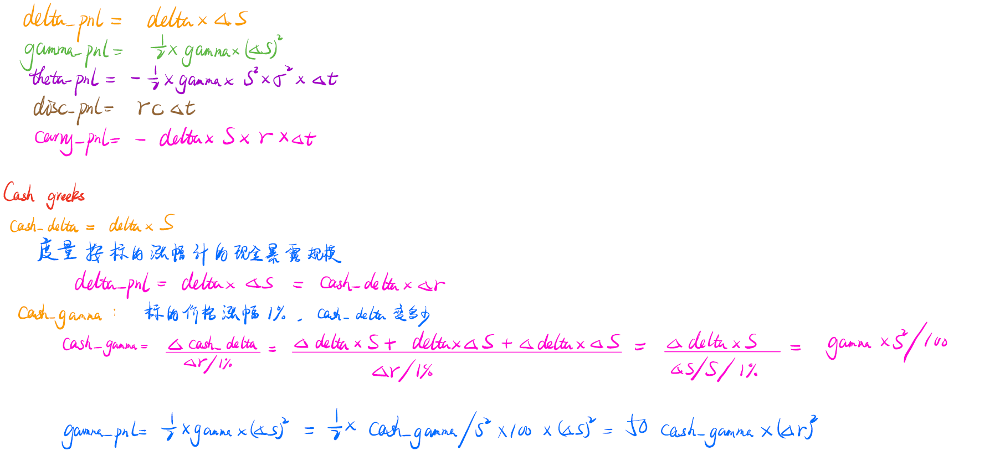
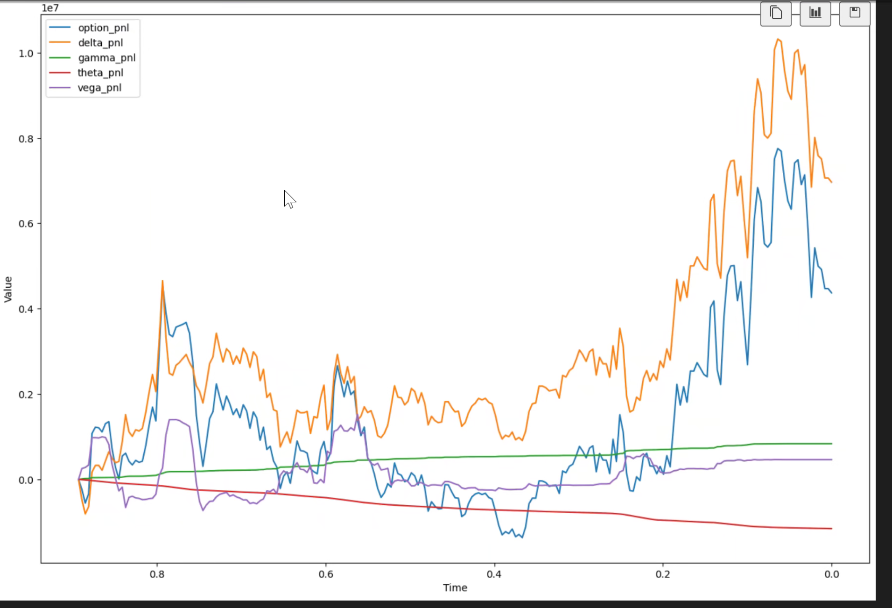

# BackTest

通过分析组合持仓变化，计算出整个对冲组合在回测期间的收益来源

- 输入：params of options and strategy

- 输出：组合pnl = 对冲端pnl + 期权端pnl
  - 对冲端pnl：利用账户式结算，讨论现金账户、保证金账户、资产账户的变化，并分析资金占用成本与交易成本- 
  - 期权端pnl：利用cash_greeks，讨论delta_pnl、gamma_pnl、theta_pnl、disc_pnl、carry_pnl的贡献

**Hegde_pnl:**

- 初始参数：

  - init_margin_ratio(init_mr)：初始保证金比例（期货50%，股票100%）

  - min_margin_ratio(min_mr)：维持保证金比例（期货25%，股票100%），当保证金账户金额小于维持保证金，则从现金账户拿钱补齐到初始保证金要求

  - max_margin_ratio(max_mr)：最大保证金比例（init_mr的1.2倍），当保证金账户金额大于最大保证金比例，则从保证金账户拿钱存入现金账户获得相对应的利息收入
  - r_tc：单边交易费用，2bps

  - r_ic: 利息率，每日1bp

- 已知 ：每日对冲端资产的价格与仓位（Pt, Qt)

- 每日更新：

  - 调仓后的$Asset Account (AA_t) = P_t ∗ Q_t$

  - 前一天持仓的盈亏 $delta\_AA_t=(P_t-P_{t-1}) ∗Q_{t-1}$

  - 调仓交易成本 $TC_t=(Q_t-Q_{t-1})∗P_t*rtx$

  - 现金账户$Cash Account（CA）$

    - 利息盈亏 $ IC_t=CA_{t-1}∗r_{ic} $
    - $CA_t = CA_{t-1}+delta\_CA_t+IC_t$

  - 保证金账户$Margin Account(MA_t )=delta\_ CA_t+ MA_{t-1}+delta\_AA_t+TC_t$

    

    | Day  | CA                      | MA                                    | AA         | delta_AA      | TC            | IC            | $\Delta$nev | nev                       |
    | ---- | ----------------------- | ------------------------------------- | ---------- | ------------- | ------------- | ------------- | ----------- | ------------------------- |
    | 0    | $-P_0 * Q_0 *init\_mr$  | $P_0 * Q_0 *init\_mr$                 | *P0 \* Q0* | *(P1-P0)\*Q0* | *P0\*Q0*      | 0             | TC0+IC0     | $\Delta$nev0              |
    | 1    | $CA_0+delta\_CA_0+IC_1$ | $delta\_ CA_1+ MA_0+delta\_AA_1+TC_1$ | *P1 \* Q1* | *(P2-P1)\*Q1* | *P1\*(Q1-Q0)* | $CA_0*r_{ic}$ | TC1+IC1     | $\Delta$nev0+$\Delta$nev1 |
    | 2    |                         | ........                              | *P2 \* Q2* | *(P3-P2)\*Q2* | *P2\*(Q2-Q1)* |               |             |                           |

    - $delta\_ CA_t$ depends on the amount of **MA** VS **min_margin** VS **max_margin**

**Option_pnl:**

- $delta\_pnl = position\_delta * \Delta S = postion\_delta * S * \Delta S/S = cash_delta*\Delta r$
- $gamma\_pnl=1/2 * position\_gamma*(\Delta S)^2=1/2*cash\_gamma/S^2*100*(\Delta S)^2=50*cash_gamma*(\Delta r)^2$

