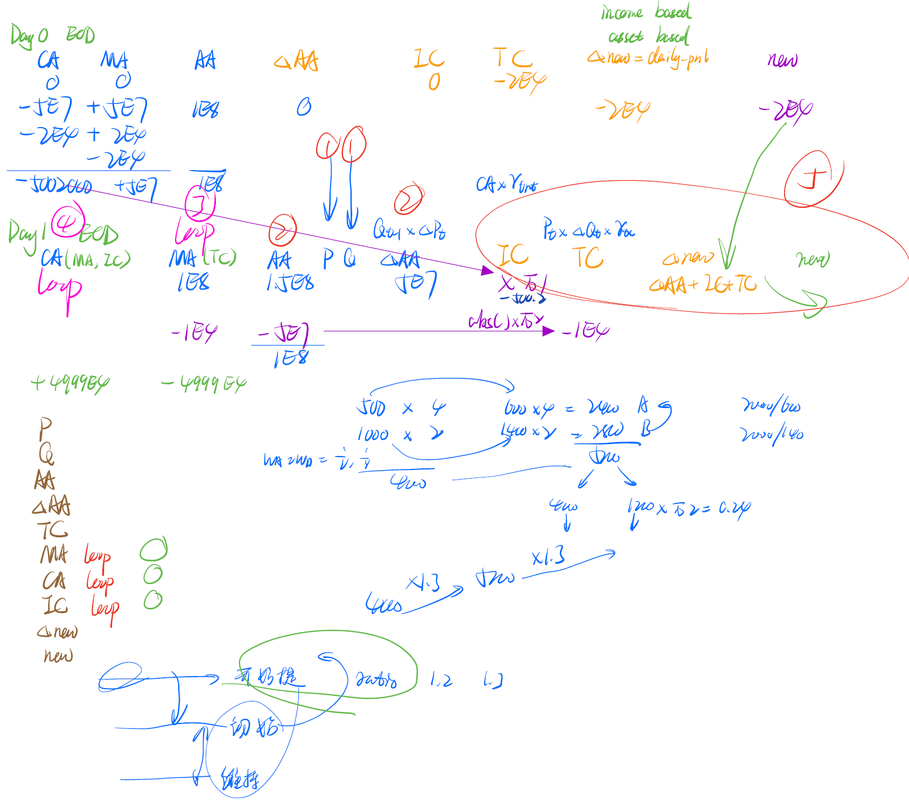

<!--
 * @Author: LetheYE
 * @email: mengjie_ye@stu.pku.edu.cn
 * @Date: 2022-11-22 12:46:03
 * @LastEditTime: 2022-11-25 23:38:05
 * @FilePath: \QTA_option_proj\01_doc\proposal.md
-->
# 四大类

1. MarketData

   1. 记录最原始的数据，应该是一个global的

   2. 属性

      1. asset_category： list， 说明有哪些对冲端的资产，比如 future，index， stock，bond，interest等等
      2. lot_size：记录每个asset最小交易的单位，比如股票就是100股为1手
      3. data：dict，key是asset_category里面的，value是dict（key是code ，value是dataframe）
      10. <!--：3~6类似，if possible，其实可以直接加属性 date_list和 field_name代表2-6的index和columns，从而直接用ndarray代替dataframe进行数据结构的优化-->
      
   3. 方法
   
      1. prepare_data()
         1. 从wind或者本地拿所有可能的data
      2. get_data(asset_category: str, code_list: list, start_date: int, end_date: int)
         1. 拿数据
         2. 返回的是dict： key是code，value是dataframe
      3. add_data(asset_category: str, code_list: list, data: pd.DataFrame)
         1. 可以自己添加数据
         这里要求我们对于各类资产作为对冲端的时候，可以买卖的限制有一定的了解，比如股指期货作为index的代替物品，保证金什么的信息
   
   目前写了一个初步的只含有stock的信息（可能不全），先看一下形式
   
2. BaseOption**【cash greeks是要在option里面的，notional不一样的时候option就不一样】**

   1. option的基类
   
   2. 属性
      1. underlying_asset:  对应MarketData里面的asset_category，str （不能写future，因为future是作为index的对冲端替代品，这里我们是'stock'
      2. underlying_code：对应code，str，'300015.SZ'
      3. strike_date：起息日，int
      4. maturity：到期日，int
      5. ISP：inital strike price S0：float，感觉这个可以作为BS_params里面的东西，因为涉及到了underlying的价格数据了，按理说是可以从marketData里面拿到的
      6. KSratio：记录K/S的比例：float
      7. strike_level：根据KSratio判定 OTM, ATM, ITM
      8. **sigma 这个不是和underlying有关系吗？应该不属于option的属性？**定义一个参数计算sigma_period=60days这种？
      9. greeks：dataframe，index是date，columns是delta，gamma, Vega, theta （cash_delta也放在这里，很多结构复杂的option是不能直接notional * greeks得到cash_greeks的）
      10. BS_params: 类似greeks，存储用BS公式算出的d1，d2，option_price，sigma，T-t
      11. 
      
   3. 方法
      1. cal_BS_params：先运行这个，再计算greeks
      
      2. cal_greeks：计算greeks，并存入greeks
      
         1. 不同的option，计算greeks的方式不同，子类进行自定义
         2. 关于St，可以从MarketData\[underlying_asset][underlying_code]取出对应dataframe，从而计算greeks
      
         

- VanillaCall
- VanillaPut
  - 继承BaseOption 只更改cal_greeks和cal_BS_params就行
  - 在实际输入给strategy的时候是option.greeks和hedge_asset hedge_code

3. BaseStrategy

   1. 输入是cash_greeks，从而根据cash_delta中性的要求计算出spot的cash_position
   2. 属性
      1. cash_greeks
      2. hedge_asset：同下
      3. hedge_code：str或者list，注意对于index来说option的underlying_code应该是index的code，spot_price应该是index的点位去看，但是用于对冲的资产需要是future或者ETF这种可以交易的东西
      5. spot_position: 根据notional和每日的greeks以及每日的spot_price计算出每日的position
         1. spot_price可以利用option的underlying信息获取
         2. dataframe，index是时间，columns是hedge_code
   3. 方法
      1. cal_position：返回spot_position
         1. 不同的strategy，重写这个方法
         2. 例如用多个不同期限结构的future对冲，那么如何分配权重，也写在这个方法中
         3. 比如最简单的hedgeAll就是 `100 * round(cash_delta/St/100)`股

   - HedgeAllStrategy
   - HedgeHalfStrategy

   

4. BackTest

   1. 输入strategy的实例 option，输出回测结果
   
   2. 属性
      1. spot_position
      
      2. init_margin_ratio：100% for stock
      
      3. keep_margin_ratio：100% for stock
   
      4. deposit_margin_ratio = multipler * init_margin_ratio：提取MA到CA的情况
      
      5. portfolio_pnl：option + hedge + trading cost + 资金成本 这个组合的收益，理想化比较平稳
      
      6. hedge_pnl：利用账户式核算进行各种更新，也是一个dataframe，columns包括（CA ，MA，AA，delta_AA，IC，TC，delta_nev，nev）
      
         - 先对P，Q，AA，delta_AA，TC进行批量化计算
         - MA CA IC就需要for loop进行计算了
      
      7. option_pnl：收益分解，dataframe，columns作为delta_pnl, gamma_pnl, theta_pnl, carry_pnl, disc_pnl, residual
         1. 
      
            1. 这里的delta是position_delta
         2. ，这里的S， sigma， t等信息应该可以从option的underlying里面拿到，是spot_price的信息。其他的greeks也可以从option拿到
      
            	3. 方法
            			1. 